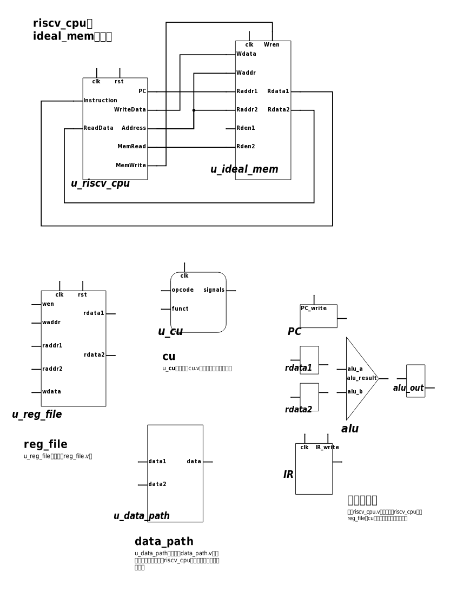
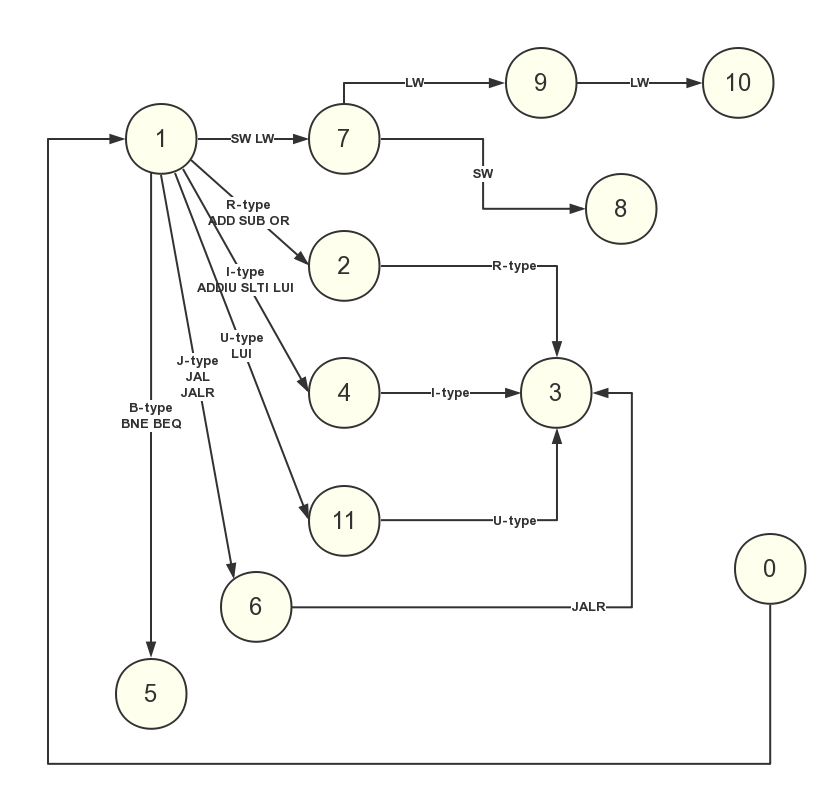

# Multi-cycle RISC-V CPU

一个简单支持 RISC-V 指令集 多周期CPU 的RTL实现

## 我要做什么

- 将一个C程序编译为RISCV的可执行文件，反汇编
- 根据反汇编得到的指令设计CPU
- RISCV CPU的RTL实现以及调试
- 上板调试(Zynq板卡)


## 具体点

## 准备工作（得到需要支持的指令）
- **下载安装交叉编译工具链**
- download riscv-tools from github
- compile and build
- **编译反汇编指定C程序得到汇编指令**
- `riscv64-unknown-elf-gcc -c  -march=rv32im -mabi=ilp32 *.c`
- `riscv64-unknown-elf-ld  -melf32lriscv -Ttext=0 -o * *.o`
- `riscv64-unknown-elf-objdump -d * > *.txt && vim *.txt`

### 准备工作产生的问题
<!-- - 64位cpu如何设计 -->

- 编译器的命令行参数学习

- 脚本程序的编写（批量编译和产生.vh文件）

<!-- - 支持不同长度指令的cpu如何设计 -->
- 上板的过程板上的各种事件（需要解决）


### 要实现CPU支持的指令

要支持的十二个测试用例来自助教老师，分别是：   
  **sum**, **mov-c**, **fib**, **add**, **if-else**, **pascal**, **quick-sort**, **select-sort**, **max**, **min3**, **switch**, **bubble-sort**.    
它们编译后得到的可执行文件反汇编后，得到下面的**15**条汇编指令，这是我需要实现的。

测试.vh和测试执行文件在[这里](https://github.com/DingShizhe/risc-v-cpu-test)。

| 指令类型 | I - type | S - type | R - type | B - type | J - type | U - type |
| ------- |----------|----------|-----------|-----------|---------|---------|
| **指令** | **addi** |  **sw**  | **add**  | **beq**   | **jal**  | **lui** |
|          | **lw**   |	        | **sub**   |  **bne**  |	       |	       |     
|          | **slli** |    		|    		|  **blt(u)**	|		|	         |
|          | **jalr** |			|	    	|  **bge(u)**	|		|	         |

##### 宏指令及其对应的原指令

|指令|**addi**|**jarl**|**blt(u)**|**bge(u)**|**jal**|
|-----|-----|-----|------|-------|-------|
|**宏指令**|**li**|**ret**|**bgt(u)**|**ble(u)**|**j**|
|		|**nop**|**jr**|		|		|		|
|		|**mv**|		|		|		|		|


## 设计多周期CPU（仿照教材COD）

### 各个模块设计大略（自己画的）


- 上图再加上（State寄存器寄存CU的状态）

### 多周期CPU的状态转换图（自己画的）




### 再加上程序计数器


### 项目文件树

```
.  
├── README.md  
├── riscv_core  
│   ├── alu.v  
│   ├── cu.v  
│   ├── data_path.v  
│   ├── reg_file.v  
│   └── riscv_cpu.v  
├── riscv_cpu_top  
│   ├── axi_lite_if.v  
│   ├── ideal_mem.v  
│   └── riscv_cpu_top.v  
└── scripts  
    ├── mk.tcl  
    └── zynq_soc.tcl  
```

## 调试

仿真12个测试用例，11个通过(显示pass)，只有quick-sort没有通过。可能是函数调用导致堆栈溢出、覆盖了内存数据区的数据。

### 调试过程产生的问题

- quick-sort.txt测试文件的栈溢出问题

- 扩展内存到2KB可解决此问题。
